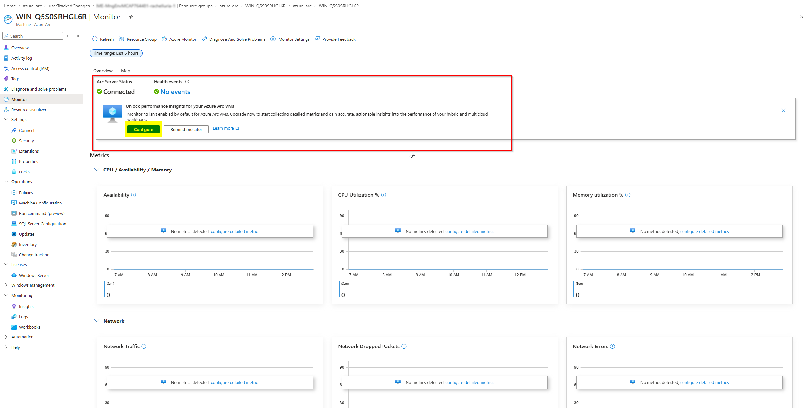

# Azure Monitor VM Insights DCR PoC Kit

Created: 2026-04-08

This kit deploys **VM Insights Data Collection Rules** for **Arc-enabled Windows servers**. It configures both the classic logs-based experience (Log Analytics) and the new metrics-based experience (Azure Monitor workspace) using the Azure Monitor Agent.

It uses:
- Azure CLI **Bash** scripts (run from Azure Cloud Shell or the Azure CLI on your workstation)
- A **Bicep template** that creates two Data Collection Rules
- A **built-in Azure Policy initiative** that automatically installs the Azure Monitor Agent and associates Arc-enabled servers with the DCRs

> ⚠️ **PoC only.** Review before running. Do not run in production without change control.

## What this automates

When you open an Arc-enabled server in the Azure Portal and navigate to **Monitor**, you'll see a prompt to unlock performance insights:



Clicking **Configure** walks through a manual wizard that creates the necessary Data Collection Rules and associates them with the machine. This repo automates that exact process — deploying the same DCRs via Bicep and using Azure Policy to automatically install AMA and associate the DCRs with all Arc-enabled Windows servers in the target resource group.

## High-level flow

1. Configure environment variables in `config/poc.env`.
2. Run the deploy script — it creates workspaces if needed, deploys DCRs via Bicep, and assigns Azure Policy.
3. Azure Policy automatically installs AMA and associates the DCRs with Arc-enabled Windows servers in the target resource group.
4. Cleanup: remove policy assignments → DCRs.

## Repo structure

```
bicep/
  vm-insights-dcr.bicep         # Bicep template: DCRs only
config/
  poc.env.template              # Environment variables template
scripts/
  deploy.sh                     # Deploy workspaces + DCRs
  assign-policy.sh              # Assign Azure Policy for AMA + DCR association
  cleanup.sh                    # Remove policy assignments + DCRs
README.md
```

## Quick start

### 0) Prereqs

- Azure CLI logged in (`az login`)
- Arc-enabled Windows servers onboarded to Azure Arc
- Permissions (choose one):
  - **Option A:** **Contributor** at the subscription level
  - **Option B:** **Monitoring Contributor** on the DCR resource group + **Log Analytics Contributor** on the workspace resource groups + **Resource Policy Contributor** on the policy scope resource group

> **Note:** AMA does not need to be pre-installed — the Azure Policy initiative will install it automatically.

### 1) Configure

Copy the env template and fill in values:

```bash
cp config/poc.env.template config/poc.env
```

Edit `config/poc.env` and fill in your subscription, workspace, and resource group values. The file is self-documented with comments.

### 2) Deploy

```bash
chmod +x scripts/deploy.sh
./scripts/deploy.sh
```

Or point to a specific env file:

```bash
./scripts/deploy.sh config/my-other.env
```

The script checks if the Log Analytics and Azure Monitor workspaces exist — if not, it creates them. Then it deploys the DCRs via Bicep.

### 3) Assign Azure Policy

```bash
chmod +x scripts/assign-policy.sh
./scripts/assign-policy.sh
```

This assigns the built-in Azure Policy initiative *[Configure Windows machines to run Azure Monitor Agent and associate them to a Data Collection Rule](https://learn.microsoft.com/en-us/azure/azure-arc/servers/deploy-ama-policy)* to the target resource group. The policy will automatically install AMA and associate the DCRs with any Arc-enabled Windows servers in that RG.

### 4) Validate

- Open the Azure Portal → Monitor → Data Collection Rules
- Confirm `vm-insights-ready-dcr` and `vm-insights-ready-otel-dcr` exist
- Navigate to Policy → Assignments and confirm the two policy assignments are active
- Open a target machine in the Portal → Insights to verify data is flowing (may take up to 30 minutes for policy remediation)

### 5) Cleanup (when done)

```bash
chmod +x scripts/cleanup.sh
./scripts/cleanup.sh
```

The cleanup script removes the policy assignments and deletes both DCRs. It reads the same env file as the deploy script:

```bash
./scripts/cleanup.sh config/my-other.env
```

## Notes / constraints

- The Azure Policy initiative handles both AMA installation and DCR association automatically for Arc-enabled Windows servers in the target resource group.
- `MONITOR_WORKSPACE_RESOURCE_GROUP` defaults to `LOG_ANALYTICS_RESOURCE_GROUP` if left blank.
- Policy remediation runs on new and existing non-compliant resources. For existing servers, you may need to trigger a remediation task manually from the Portal.
- Reference: [Deploy and configure Azure Monitor Agent using Azure Policy](https://learn.microsoft.com/en-us/azure/azure-arc/servers/deploy-ama-policy)
