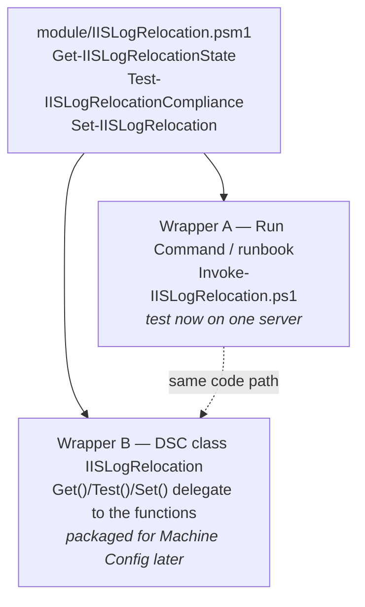

# IIS `inetpub\logs` Relocation (C: → E:)

Detects Windows servers that have the **IIS** feature installed and relocates the
`inetpub\logs` folder — the **W3C site access logs** (`LogFiles`) and **failed-request trace
logs** (`FailedReqLogFiles`) — off the OS drive (`C:`) to a data drive (default
`E:\inetpub\logs`). This keeps IIS logging from filling `C:` and crashing the OS, and removes
the recurring alerts / manual cleanup / incidents that go with it.

> Status: **Phase 1 — interactive test wrapper.** The logic is authored once and tested via
> Azure Run Command / a runbook on a single server. A later phase packages the *same* module
> as an **Azure Machine Configuration** policy for continuous, fleet-wide enforcement (see
> [How this becomes a policy](#how-this-becomes-an-azure-machine-configuration-policy)).

---

## What it does

| Behaviour | Detail |
|---|---|
| **Detection** | Self-gates on IIS. No IIS → no-op (compliant). No separate inventory needed. |
| **Scope** | `inetpub\logs\LogFiles` (W3C) and `inetpub\logs\FailedReqLogFiles`. Repoints `siteDefaults` **and** any individual site whose log path is still on `C:`. HTTP.sys error logs (`HTTPERR`) are out of scope. |
| **Existing files** | Moved to `E:\` with `robocopy /MOVE /COPYALL` (NTFS ACLs preserved). |
| **Target folders** | Created with ACLs: `SYSTEM` + `Administrators` Full; `IIS_IUSRS` Modify on `FailedReqLogFiles` (worker process writes FRT logs). |
| **No `E:` drive** | **Soft-skip** — no change, no fallback to `C:`, no hard failure. Logs Application event **1001** so skipped servers can be reported. |
| **Idempotent** | Re-running is a no-op once logs are on `E:`. |
| **Auditability** | Application event **1000** on success, **1001** on skip (source `IISLogRelocation`). |

> **Active log file:** the currently open log is locked by `http.sys`, so `robocopy /MOVE`
> leaves it on `C:`; IIS rolls over to `E:` on the next log period. This is by design — no
> `iisreset` / downtime is triggered.

---

## Files

| Path | Purpose |
|---|---|
| [`module/IISLogRelocation.psm1`](module/IISLogRelocation.psm1) | **Single source of truth** — `Get`/`Test`/`Set` functions **and** the `[DscResource()]` class. |
| [`module/IISLogRelocation.psd1`](module/IISLogRelocation.psd1) | Module manifest (exports functions + the DSC resource — package-ready). |
| [`scripts/Invoke-IISLogRelocation.ps1`](scripts/Invoke-IISLogRelocation.ps1) | Thin Run Command / runbook wrapper for testing on one server. |
| [`runbook/Relocate-IISLogs.runbook.ps1`](runbook/Relocate-IISLogs.runbook.ps1) | **Self-contained** Azure Automation runbook (module embedded verbatim) — import and click Start. |
| [`scripts/deploy-runbook.sh`](scripts/deploy-runbook.sh) | Publishes the runbook to an Automation Account and (optionally) onboards an Arc server as a Hybrid Worker. |
| [`policy/onboard-hybrid-worker.rules.json`](policy/onboard-hybrid-worker.rules.json) | Custom **DeployIfNotExists** policy rule — installs the Hybrid Worker extension + registers Arc servers at scale. |
| [`policy/onboard-hybrid-worker.params.json`](policy/onboard-hybrid-worker.params.json) | Parameters for the onboarding policy (Automation Account, group, effect). |
| [`scripts/assign-hybrid-worker-policy.sh`](scripts/assign-hybrid-worker-policy.sh) | Creates + assigns the onboarding policy and grants the MI its roles (mirrors the AMA pattern). |
| [`scripts/remediate-hybrid-worker-policy.sh`](scripts/remediate-hybrid-worker-policy.sh) | Remediation task to onboard pre-existing Arc servers. |
| [`tests/IISLogRelocation.Tests.ps1`](tests/IISLogRelocation.Tests.ps1) | Pester unit tests (mock IIS/filesystem — run anywhere). |

---

## Architecture: one module, two wrappers



The Run Command wrapper and the DSC resource call the **identical** functions, so a behaviour
you validate interactively is exactly what the policy enforces — nothing is rewritten.

---

## Test it now (one server)

### Prerequisites
- Windows Server with PowerShell 5.1+.
- Run as **Administrator** / **SYSTEM** (needed to edit IIS config, set ACLs, write the event log).
- A data drive present (default `E:`). Servers without it are reported, not changed.
- Copy the `iis-log-relocation` folder to the server (or `git clone` the repo) so the wrapper
  can import the sibling module. For an inline Run Command push, see the note below.

### Run locally on the box

```powershell
# 1) Dry run — shows exactly what WOULD change, touches nothing
.\scripts\Invoke-IISLogRelocation.ps1 -WhatIf

# 2) Report only — current state + per-directory table, no changes
.\scripts\Invoke-IISLogRelocation.ps1 -AuditOnly

# 3) Remediate
.\scripts\Invoke-IISLogRelocation.ps1

# Custom target drive/path
.\scripts\Invoke-IISLogRelocation.ps1 -TargetLogRoot 'E:\inetpub\logs' -AuditOnly
```

### Run it as an Azure Automation runbook (self-service, ad-hoc) — *easiest option*

**This is the simplest way to run it on one server**, and the recommended starting point for a
customer who wants to run it themselves with a button click. Publish the self-contained runbook
[`runbook/Relocate-IISLogs.runbook.ps1`](runbook/Relocate-IISLogs.runbook.ps1). The relocation
functions are copied **verbatim** from the module (regenerate with `.tmp/build-runbook.ps1` if
the module changes), so there is no logic drift and nothing to paste in.

```bash
# Publish the runbook to the Automation Account named in config/poc.env
./iis-log-relocation/scripts/deploy-runbook.sh

# Publish AND onboard the IIS server as a Hybrid Runbook Worker in one go
./iis-log-relocation/scripts/deploy-runbook.sh --onboard-worker <arc-machine>
```

Why a Hybrid Runbook Worker: the runbook touches the local filesystem, `appcmd`, and `W3SVC`,
so it must execute **on the IIS server**, not in the Azure cloud sandbox. The onboarding step
installs the Hybrid Worker extension on the Arc machine; after that the customer just opens the
Automation Account → the runbook → **Start → Run on: Hybrid Worker** (set `AuditOnly=true` for
a dry run). No script editing.

> **Hybrid Worker footprint / ramifications:** the extension installs a lightweight agent
> (`HybridWorker` / Automation worker service) that idles in the background and polls Azure
> Automation for jobs — a small, steady CPU/memory cost when no job is running. Meaningful
> CPU/memory is consumed **only while a runbook job is actually executing**, and that is
> proportional to the runbook's own work (here a brief `robocopy`/`appcmd` pass). It also uses
> some local disk for the extension and its logs, and opens **outbound HTTPS (443)** to Azure
> Automation / Service Bus endpoints — **no inbound ports** are opened. If you prefer not to
> leave a resident agent on the box, use the Run Command alternative below instead.

### Push to a single Azure Arc-enabled server via Run Command — *alternative*

A more manual alternative to the runbook above — handy for a one-off push when you don't want to
stand up an Automation Account / Hybrid Worker. Audit first, then remediate after you are
satisfied:

```bash
# Audit
az connectedmachine run-command create \
  --name iis-log-audit \
  --machine-name <server> \
  --resource-group azure-arc \
  --location westus2 \
  --script @scripts/Invoke-IISLogRelocation.ps1 \
  --parameters AuditOnly=true

# Remediate
az connectedmachine run-command create \
  --name iis-log-remediate \
  --machine-name <server> \
  --resource-group azure-arc \
  --location westus2 \
  --script @scripts/Invoke-IISLogRelocation.ps1
```

> **Inline push (no files on disk):** Run Command executes a single script. To run without
> copying the module, concatenate the module body and the wrapper into one script, or host the
> module and add `-ModulePath`. The folder-on-the-box approach above is simplest for testing.

### Onboard the whole fleet with Azure Policy (at scale)

For more than a handful of servers, onboard them to the Hybrid Worker group with a custom
**DeployIfNotExists** policy instead of `--onboard-worker` per machine — the same governance
model as the repo's AMA policy ([`scripts/assign-policy.sh`](../scripts/assign-policy.sh)).
There is **no built-in** policy for Hybrid Worker onboarding, so the definition lives in
[`policy/onboard-hybrid-worker.rules.json`](policy/onboard-hybrid-worker.rules.json): it targets
Windows Arc machines, and where the Hybrid Worker extension is missing it deploys both the
group registration and the `Microsoft.Azure.Automation.HybridWorker` extension.

```bash
# 1) Publish the runbook + create the Automation Account (once)
./iis-log-relocation/scripts/deploy-runbook.sh

# 2) Assign the onboarding policy to the Arc servers' resource group
./iis-log-relocation/scripts/assign-hybrid-worker-policy.sh

# 3) Onboard servers that already exist (new ones are handled automatically)
./iis-log-relocation/scripts/remediate-hybrid-worker-policy.sh
```

The assign script reads the account's `automationHybridServiceUrl`, assigns the policy with a
system-assigned identity, and grants that identity **Azure Connected Machine Resource
Administrator** (on the Arc machines) + **Automation Contributor** (on the Automation Account
RG). Settings come from `config/poc.env` (`AUTOMATION_ACCOUNT_NAME`, `HYBRID_WORKER_GROUP`,
`POLICY_SCOPE_RESOURCE_GROUP`). Start the policy in `AuditIfNotExists` (the `effect` parameter)
to see which servers would be onboarded before switching to `DeployIfNotExists`.

> Note: this onboards the **runbook execution host** at scale. It is separate from the later
> Machine Configuration policy that enforces the relocation itself — see
> [How this becomes a policy](#how-this-becomes-an-azure-machine-configuration-policy).

### Parameters

| Parameter | Default | Description |
|---|---|---|
| `-TargetLogRoot` | `E:\inetpub\logs` | Destination root. `LogFiles` and `FailedReqLogFiles` are created beneath it. |
| `-AuditOnly` | off | Report state only; make no changes. |
| `-WhatIf` | off | Dry run — prints intended actions, changes nothing. |
| `-ModulePath` | auto | Explicit path to `IISLogRelocation.psm1` if not beside the script. |

### Run the unit tests

```powershell
Invoke-Pester -Path .\tests
```

The tests mock all IIS / filesystem calls, so they pass on any machine (no IIS required).

---

## How this becomes an Azure Machine Configuration policy

> **This is a next step, not a requirement.** If you just want to fix servers on demand, the
> manual runbook (or Run Command) above is all you need — click it when you want it to run. The
> Machine Configuration policy is only worth doing if you want the relocation to run
> **automatically and continuously** — the Guest Configuration agent re-checks and self-corrects
> every server every ~15 min with no manual click. Reach for it when you're managing a fleet and
> want ongoing enforcement rather than a one-time, on-demand fix.

No logic changes — the *same* `module/IISLogRelocation.psm1` is reused. The mapping:

| Run Command (now) | Machine Configuration (later) |
|---|---|
| `Invoke-IISLogRelocation.ps1` imports the module | DSC class `IISLogRelocation` lives **in** the module |
| `Get-IISLogRelocationState` | `class.Get()` delegates to it |
| `Test-IISLogRelocationCompliance` | `class.Test()` delegates to it |
| `Set-IISLogRelocation` (`-WhatIf`-aware) | `class.Set()` delegates to it |
| You run it on one server | The Guest Configuration agent runs `Get`/`Test`/`Set` on every server every ~15 min |

Planned next-phase steps (a later deliverable):

1. **Build** — `New-GuestConfigurationPackage` zips this module → `IISLogRelocation.zip`.
2. **Host** — upload the package to a storage blob (`contentUri` + `contentHash`).
3. **Policy** — `New-GuestConfigurationPolicy`, starting in **Audit** mode → `az policy definition create`.
4. **Assign / remediate** — mirror the repo's existing pattern in
   [`scripts/assign-policy.sh`](../scripts/assign-policy.sh) and
   [`scripts/remediate-policy.sh`](../scripts/remediate-policy.sh): assignment with a
   system-assigned identity + role grants, then trigger remediation.

**Safe rollout:** test on one server (Run Command) → assign the policy in **Audit** mode to
confirm which IIS servers are flagged → scope to a test resource group / tag → switch to
**ApplyAndAutoCorrect** → broaden to the fleet.

---

## Notes & limitations

- Uses only `appcmd.exe`, `robocopy.exe`, `Get-Service`, and `Get-Acl`/`Set-Acl` — all present
  on a server with the IIS role and available to the SYSTEM-context Guest Configuration agent
  (no dependency on the `WebAdministration` module).
- HTTP.sys error logs (`%SystemRoot%\System32\LogFiles\HTTPERR`) are **not** moved (out of scope).
- This is a PoC-stage component; package signing is deferred (planned for the policy phase).
